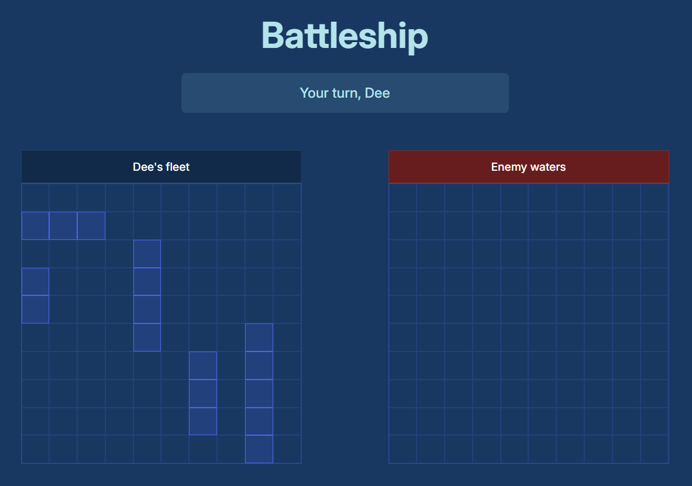

# Battleship

A browser-based implementation of the classic naval strategy game built with vanilla JavaScript and Test-Driven Development principles.

[Live Demo](https://dee-diaz.github.io/battleship/) | [Report Bug](https://github.com/dee-diaz/battleship/issues)



## About The Project

This project is the final assignment for The Odin Project's JavaScript course. It implements the classic Battleship game with a focus on object-oriented programming, clean architecture, and comprehensive test coverage.

### Features

- **Interactive Ship Placement**: Drag and preview ships with visual feedback before placement
- **Multiple Placement Modes**: Place ships manually along X/Y axes or use random placement
- **Smart AI Opponent**: Bot uses strategic targeting after successful hits
- **Responsive Design**: Fully playable on desktop and mobile devices
- **Visual Feedback**: Clear indicators for hits, misses, and sunken ships
- **Game State Management**: Proper turn-based gameplay with status updates

### Built With

- Vanilla JavaScript (ES6+)
- Jest (testing framework)
- Webpack (module bundling)
- HTML5 & CSS3

## Project Structure

```
battleship/
├── src/
│   ├── components/
│   │   ├── Gameboard.js      # Game board logic and ship placement
│   │   ├── Ship.js            # Ship class with hit detection
│   │   ├── Player.js          # Player entity
│   │   ├── Render.js          # DOM rendering utilities
│   │   └── utils.js           # Helper functions
│   ├── Game.js                # Main game controller
│   ├── index.js               # Entry point
│   └── style.css              # Styling
├── tests/
│   ├── Gameboard.test.js      # Gameboard unit tests
│   └── Ship.test.js           # Ship unit tests
└── dist/                      # Built files
```

## Architecture Highlights

### Object-Oriented Design

- **Ship**: Manages individual ship state (length, hits, sunk status)
- **Gameboard**: Handles grid logic, ship placement validation, and attack processing
- **Player**: Encapsulates player type (human/bot) and their gameboard
- **Game**: Main controller orchestrating gameplay flow and UI interactions
- **Render**: Pure rendering functions separated from game logic

### Key Implementation Details

- **Private fields** (`#shipPositions`, `#allShipsSunk`) for proper encapsulation
- **Map data structure** for efficient grid operations
- **Adjacent placement validation** prevents ships from touching
- **Strategic AI** that targets adjacent cells after hits and follows directional patterns
- **Dual-mode placement** system for preview and actual ship placement

## Testing

The project includes unit tests covering:

- Ship hit detection and sunk status
- Gameboard coordinate validation
- Ship placement logic (valid/invalid scenarios)
- Overlap and adjacency detection
- Attack processing and game-over conditions
- Random ship placement algorithm

Test coverage focuses on edge cases and error handling to ensure robust gameplay.

## Lessons Learned

This project reinforced several key programming concepts:

- **Test-Driven Development**: Writing tests first helped clarify requirements and prevent regressions
- **Separation of Concerns**: Keeping game logic separate from rendering made the code more maintainable
- **State Management**: Properly managing game state across turns and player actions
- **Algorithm Design**: Implementing pathfinding and strategic decision-making for the AI

## Acknowledgments

- [The Odin Project](https://www.theodinproject.com/) for the excellent curriculum
- Classic Battleship game by Milton Bradley

Project Link: [https://github.com/dee-diaz/battleship](https://github.com/dee-diaz/battleship)

---

**Note**: This project was created as part of The Odin Project's JavaScript curriculum and represents the culmination of learning modern JavaScript development practices.
